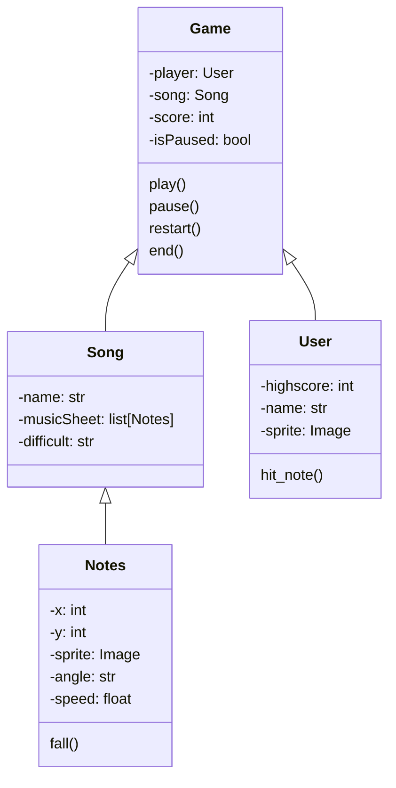

# Projeto Jogo POO #


## Modelagem
A classe `Game` irá gerenciar todo o funcionamento da partida, como a pontuação, a música, o jogador e o estado do jogo (pausado ou não). A classe `User` irá armazenar o nome do jogador e sua pontuação máxima. A classe `Song` irá armazenar o nome da música, sua dificuldade e a lista de notas. A classe `Notes` irá armazenar a posição da nota, sua velocidade e sua imagem.

Enquanto o jogo estiver rodando, a classe `Game` irá chamar o método `fall()` da classe `Notes` para cada nota da música. Esse método irá atualizar a posição da nota e verificar se ela foi acertada pelo jogador. Caso a nota tenha sido acertada, o método `hit_note()` da classe `User` será chamado, atualizando a pontuação do jogador.


#
## Padrão de commit

Os commits devem ser semânticos e seguir o seguinte padrão:

```
feat: Adiciona gatinho dançante
^--^   ^------------^ -> Mensagem no imperativo
 *-> Tipos: chore, docs, feat, fix, refact, style or test.
```

Os tipos disponíveis são:

- `docs`: se refere à alterações na documentação.
- `feat`: se refere à implementação de features.
- `fix`: se refere à uma correção.
- `refact`: se refere à refatoração de uma feature previamente implementada.
- `style`: se refere à uma mudança estética no código. Por exemplo: alterar a indentação de espaço para tab.
##


#1 INSTRUÇÕES DE INSTALAÇÃO:
- git clone https://github.com/ArturMota19/pooGame.git
- abra o terminal do seu editor de código no diretório do projeto
- pip install git+https://github.com/rodrigorgs/tupy.git
- pip install jurigged

#2 INICIAR O PROJETO:
- jurigged main.py

#3 ORGANIZAÇÃO DE BRANCHS
- Para cada implementação, crie uma branch nova com o padrão dos tipos disponíveis e o nome do que será implementado;
  Exemplo: [feat/gatinho-dancante], [refact/gatinho-pulante];
- Para criar uma branch, use: git checkout -b x-nome-da-branch;
- Após criar a branch pra sua implementação, faça o que quiser nela, pois ainda não está na branch main, logo, não
  oferece risco à branch de produção;
- Depois de terminar a branch que você estava fazendo, dê git push, solicite o merge da sua branch e marque os outros devs do projeto como revisores do código, uma vez aprovado por TODOS, poderá subir pra main;
- *NÃO CODAR NA PASTA MAIN!*

#4 MANTENDO SUA BRANCH ATUALIZADA
- Sempre que houver uma nova atualização, use "git pull origin main";
- Isso serve para que nossas branchs não tenham conflito, uma vez que pode ocorrer de alguém atualizar o código e
  você ainda não ter essa atualização na sua máquina, e vice-versa.
