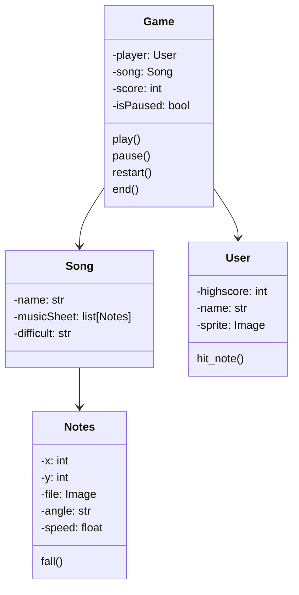

# Guitar Hero do Forró

## Equipe
- Arthur dos Santos Silva
- Artur Mota
- Bruna Anunciação
- João Paulo Gomes Bernardino
- Victoria Beatriz

#

## Modelagem

## Descrição
Para o trabalho final da disciplina de Programação Orientada a Objetos, a equipe escolheu desenvolver um projeto no estilo "Guitar Hero", no qual o jogador precisa pressionar as teclas no momento correto conforme as notas da música aparecem na tela. Durante a implementação do projeto, foi possível aplicar vários conceitos aprendidos ao longo do semestre.

## Como usar o programa

### Inicialização
Para iniciar o projeto basta rodar o arquivo main.py por meio do comando "jurigged main.py" ou "python main.py".

### Menu
No primeiro momento, é possível escolher uma entre cinco músicas. Após a escolha da música, o usuário deve selecionar a dificuldade da gameplay entre fácil, médio ou difícil.

### Gameplay
Durante a gameplay, as notas musicais serão exibidas na tela na forma de linhas que descem em direção a uma região com marcações de setas. Quando as notas alcançarem essas regiões, o jogador deve pressionar as setas correspondentes no teclado. Se acertar o momento exato, a pontuação do jogador será aumentada. No caso de pressionar no momento errado ou não pressionar, a pontuação será reduzida.

#

## Divisão das tarefas da Equipe
### Arthur:
- Implementou método de pontuação variada, somando a depender do lugar que o player apertar pra sumir a tecla
- Atualização das docs para requisitos do trabalho
- Nota: 5

### Artur:
- Adicionando função de pontuação por click (sem raios de pontuação)
- Adicionando background e personagem dinâmico
- Gerar partituras aleatoriamente e hitbox esquerda-direita
- Nota: 5

### Bruna:
- Implementando função das notas sumirem
- Criando menu pra início e seleção de dificuldade
- Criando menu para seleção da música
- Nota: 5

### João Bernadino:
- Modelagem na documentação
- Setup do projeto, escopo inicial
- Adicionando player
- Adicionando música ao projeto com pygame
- Nota: 5

### Victoria:
- Implementou função de soma pro score
- Adicionando modos de dificuldade Fácil, Médio e Difícil
- Nota: 5